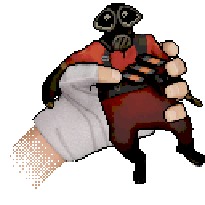
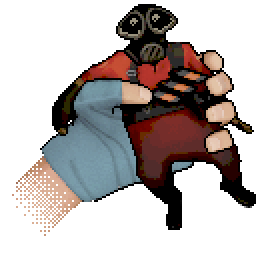
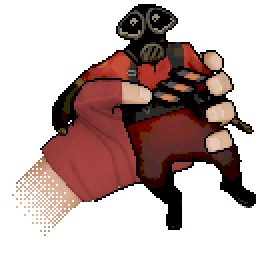
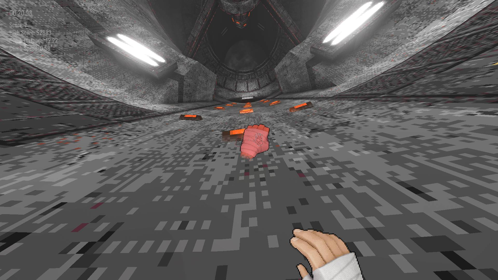
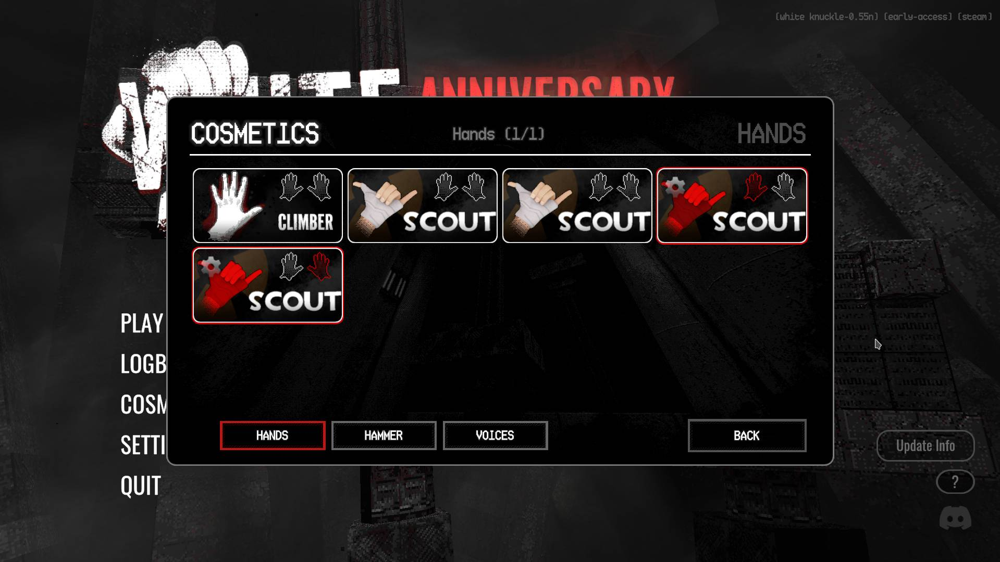
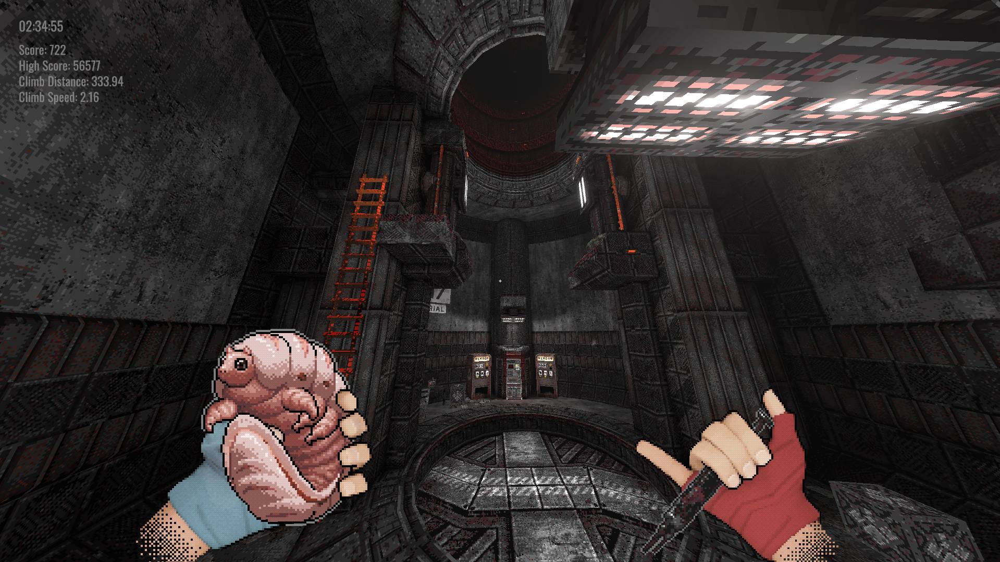
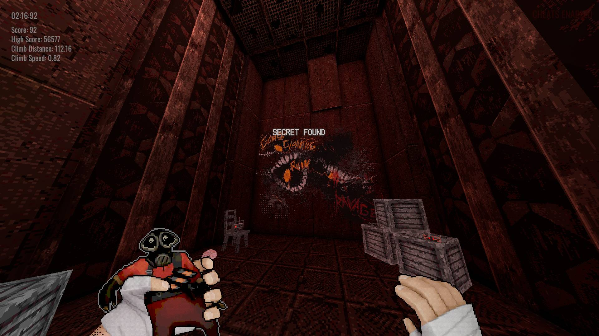

<h1 align='center'> Scout TF2 Cosmetics for White Knuckle  
By GibbDev
</h1>

<h2>Table of contents</h2>
<ul><a href='https://github.com/GibberishDev/whucklemods/tree/main/tf2_scout#description'>Description</a></ul>
<ul><a href='https://github.com/GibberishDev/whucklemods/tree/main/tf2_scout#showcase'>Showcase</a></ul>
<ul><a href='https://github.com/GibberishDev/whucklemods/tree/main/tf2_scout#installation'>Installation</a></ul>
<ul><a href='https://github.com/GibberishDev/whucklemods/tree/main/tf2_scout#ToDo'>ToDo</a></ul>

# Description

Team Fortress 2 Scout is iconic character. I love TF2. Some say a bit much...

BUT for <b>you</b> that means there are a bunch of White Knuckle resource packs. Main functionality is supported by vanilla game cosmetic system but some additional functionality requires additional game modification.

Content Support Table

| | Pack | type | Game Version | Mods | Notes |
| --- | --- | --- | --- | --- | --- |
|  | 
Scout TF2
 | 
Hands
 | 0.55+ | 
X No
 | Standard pack with just hand retextures |
|  | 
Scout TF2 BLU
 | 
Hands
 | 0.55+ | 
X No
 | Version of Standard pack with BLU styles hand wraps |
|  | 
Scout TF2 RED
 | 
Hands
 | 0.55+ | 
X No
 | Version of Standard pack with RED styles hand wraps |
|  | 
Scout TF2 (Item retextures)
 | 
Hands
 | 0.55+ | 
X No
 | Standard pack with additional items that can be held retextured |
|  | 
Scout TF2 RED (Item retextures)
 | 
Hands
 | 0.55+ | 
X No
 | BLU team pack with additional items that can be held retextured|
|  | 
Scout TF2 RED (Item retextures)
 | 
Hands
 | 0.55+ | 
X No
 | RED team pack with additional items that can be held retextured |
|  | 
Scout TF2
 | 
Voice
 | 0.55+ | 
~ Optional
 | Scout voice replacements for most actions. Jumps do __not__ include occasional voicelines (Hes obnoxious enough) Additional features that require mods:<ul>Sentry audio replacement so it sounds like TF2 lvl2</ul><ul>Hammer denizen hit sounds that sound like stock bat</ul><ul>Hammer creature kill sounds with occasional scout gloating _bonk!_ |
|  | 
Scout TF2 (Loud jumps)
 | 
Voice
 | 0.55+ | 
~ Optional
 | Scout voice replacements for most actions. Jumps include occasional voicelines (Hes not obnoxious enough) Additional features that require mods:<ul>Sentry audio replacement so it sounds like TF2 lvl2</ul><ul>Hammer denizen hit sounds that sound like stock bat</ul><ul>Hammer creature kill sounds with occasional scout gloating _bonk!_ |

# Showcase
</img>
</img>
</img>
</img>
# Installation

> [!WARNING]
> As of writing Resourceful Hands mod is still in development and some required features are missing.
> In addition vanilla cosmetic system is limiting and doesnt support everything these packs have to offer.
> There _is_ a way to install everything RIGHT NOW but it requires a lot of jank and will not be supported in future. wait for Resourceful Hands mod update or use limited capabilities of vanilla version

## Modded
Search Scout TF2 in Thunderstore/R2Modman mod browser and install.  
If you prefer manual installation required mods are: 
1. __BepInExPack__ by BepInEx - v5.4.2305 or above 
Launch the game once to generate all the BepInEx folders
2. __Resourceful Hands__ by MonkSilly - v0.11.0 or above 
Put RH into `BepInEx/plugins` folder.
3. __Scout TF2__
Put contents of zip into `BepInEx/plugins` folder.
> [!IMPORTANT]
> Current version of RH doesnt support loading voice cosmetics. this is a confirmed bug and will be fixed soon.

If everything done correctly when in-game you will see several packs inside cosmetics menu

## Vanilla
To install manually:
1. Download latest version from [Releases](https://github.com/GibberishDev/whucklemods/releases)
2. Unzip the scout-tf2 archive
3. Put packs with `-hands` into `[Steam game install]/White Knuckle_Data/Mods/Cosmetics/Hands` folder
4. Put packs with `-voices` into `[Steam game install]/White Knuckle_Data/Mods/Cosmetics/Voices` folder
5. Launch the game
> [!IMPORTANT]
> Vanilla cosmetic system for voices doesnt support custom sounds outside very limited range of player sounds.

# ToDo

11 / 28 [███████████▓▓▓▓▓▓▓▓▓▓▓▓▓▒▒▒▒] 47% Done

| 
Done?
 | 
White Knuckle Item
 | 
Retexture
 |
| --- | --- | --- |
| ✓ | Slub | Tiny pyro (team colored)|
| ✓ | Injector | Bonk™ styled injector (team colored)|
| ✓ | Veans | Bonk™ and Crit-a-Cola cans (team colored)|
| ✓ | Explosive rebar | soldiers rocket|
| ✓ | Foodbar | Dalokohs bar|
| ✓ | Milk | Mad milk|
| ✓ | Flares | Pyro's flaregun ammo|
| ✓ | Bandage | Small medkit|
| ✓ | Candy cauldron | Large medkit (halloween)|
| ✓ | Photo trinket | Miss Pauling photo|
| ✓ | Employee Id trinket | Black Mesa Anomalous Materials researcher badge (Gordon lost it 5 weeks before the casqade)|
| ✘ | Piton | MannCo crate key |
| ✘ | Piton (Piton Enthusiast) | MannCo EotL crate key |
| ✘ | Piton (XMas) | MannCo "Nice Winter" crate key  |
| ✘ | Rebar | Hunstman arrow|
| ✘ | Rope Rebar | Hunstman arrow with rope coil|
| ✘ | Festive Rebar | Scout TF2 candy cane |
| ✘ | Blinkeye | Monoculus|
| ✘ | Flaregun | Flaregun (stolen from pyro I guess)|
| ✘ | Cocoa | Demo's botl|
| ✘ | Pipewrench (parasite) | Engie wrench|
| ✘ | Timepiece artifact | Deadringer|
| ✘ | Remote artifact | Destruction pda|
| ✘ | Astro glove artifact | Hot hand|
| ? | Floppy disks | TF2 recolors and TF2 logo|
| ? | Brick | Flying Guillotine (I think brick is the only item using *2D4 sprite)|
| ? | Scanner | Wrangler with rescue ranger screen|
| ? | Translocator artifact | Tiny~~desk™~~ engineer teleporter|

