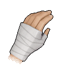
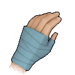
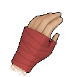

<h1 align='center'> Scout TF2 Cosmetics for White Knuckle  
By GibbDev
</h1>

<h2>Table of contents</h2>
<ul><a href='https://github.com/GibberishDev/whucklemods/tree/main/tf2_scout#description'>Description</a></ul>
<ul><a href='https://github.com/GibberishDev/whucklemods/tree/main/tf2_scout#showcase'>Showcase</a></ul>
<ul><a href='https://github.com/GibberishDev/whucklemods/tree/main/tf2_scout#installation'>Installation</a></ul>

# Description

Team Fortress 2 Scout is iconic character. I love TF2. Some say a bit much...

BUT for <b>you</b> that means there are a bunch of White Knuckle resource packs. Main functionality is supported by vanilla game cosmetic system but some additional functionality requires additional game modification.

Content Support Table

| | Pack | type | Game Version | Mods | Notes |
| --- | --- | --- | --- | --- | --- |
|  | 
Scout TF2
 | 
Hands
 | 0.55+ | 
X No
 | Standart pack with just hand retextures |
|  | 
Scout TF2 BLU
 | 
Hands
 | 0.55+ | 
X No
 | Version of standart pack with BLU styles hand wraps |
|  | 
Scout TF2 RED
 | 
Hands
 | 0.55+ | 
X No
 | Version of standart pack with RED styles hand wraps |
|  | 
Scout TF2
 | 
Voice
 | 0.55+ | 
~ Optional
 | Scout voice replacements for most actions. Jumps do __not__ include occasional voicelines (Hes obnoxios enough) Additional features that require mods:<ul>Sentry audio replacement so it sounds like TF2 lvl2</ul><ul>Hammer denizen hit sounds that sound like stock bat</ul><ul>Hammer creature kill sounds with occasional scout gloating _bonk!_ |
|  | 
Scout TF2 (Loud jumps)
 | 
Voice
 | 0.55+ | 
~ Optional
 | Scout voice replacements for most actions. Jumps include occasional voicelines (Hes not obnoxios enough) Additional features that require mods:<ul>Sentry audio replacement so it sounds like TF2 lvl2</ul><ul>Hammer denizen hit sounds that sound like stock bat</ul><ul>Hammer creature kill sounds with occasional scout gloating _bonk!_ |